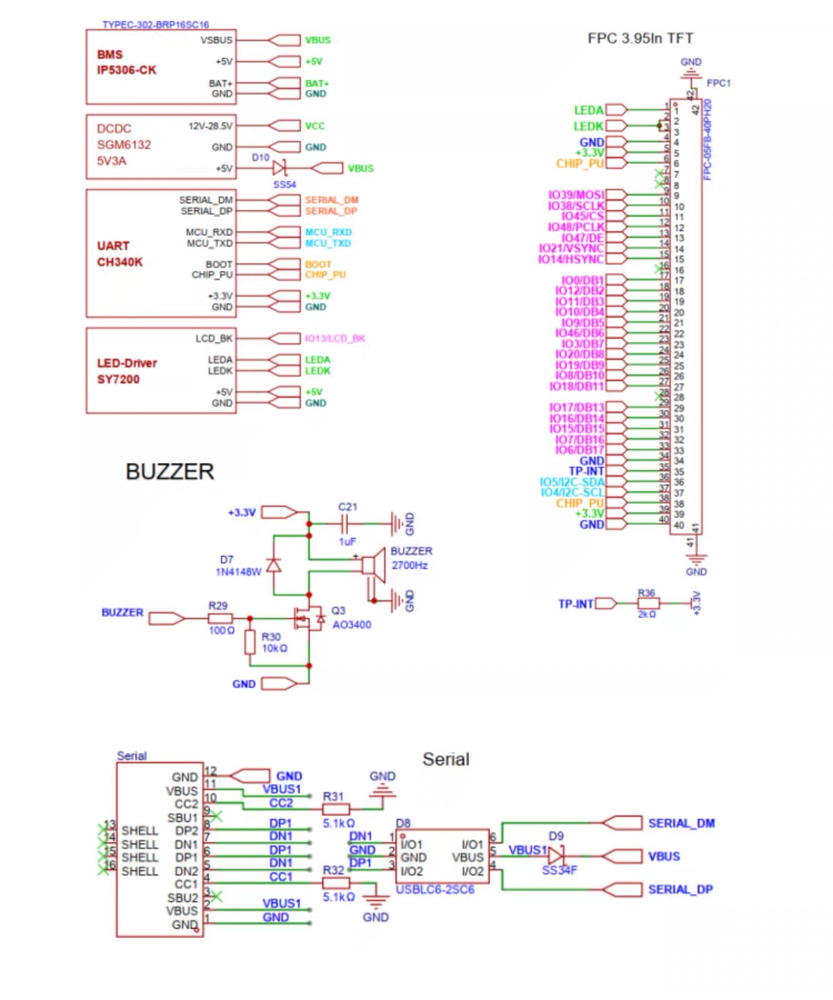

# ESPHome Modular LVGL Buttons

This project provides a modular configuration for ESPHome using LVGL for creating interactive buttons on a touchscreen display.

## Original Project

This project is based on: [https://github.com/agillis/esphome-modular-lvgl-buttons](https://github.com/agillis/esphome-modular-lvgl-buttons)

## Hardware Specifications

### Datasheet
*   **Screen & Touch IC**: [osptek 4-inch 480x480 Smart Screen](https://yuyinglcd.com/products/1/4/245)
*   **Touch IC Datasheet (Local)**: [FT6336U Datasheet](hardware/D_FT_6336_U_Data_Sheet_V1_1_410131a74f.pdf)
*   **MCU Datasheet (Local)**: [ESP32-S3 Datasheet](hardware/ESP32-S..25.pdf)

Detailed hardware configuration can be found in `hardware/ospreypi-esp32-s3-48x48.yaml`.

### Device Gallery

  
  
  

**Device**: ESP32-S3 (480x480 Smart Screen)

*   **MCU**: ESP32-S3-1-N16R8 (16MB Flash, 8MB Octal PSRAM)
*   **Display Driver**: ST7701S (RGB interface)
*   **Touch Driver**: FT6336 (I2C)

### Pin Definition

| Component | Pin(s) | Description |
| :--- | :--- | :--- |
| **I2C Bus** | SDA: 5, SCL: 4 | Touchscreen & other I2C devices |
| **Display SPI** | CLK: 38, MOSI: 39, CS: 45 | Display Initialization |
| **Display RGB** | DE: 47, VSYNC: 21, HSYNC: 14, PCLK: 48 | RGB Data Interface |
| **Backlight** | GPIO 13 | PWM driven backlight |
| **Buzzer** | GPIO 42 | Onboard buzzer |

### RGB Data Pins

*   **Red**: 17, 16, 15, 7, 6
*   **Green**: 46, 3, 20, 19, 8
*   **Blue**: 0, 12, 11, 10, 9

## Getting Started

Refer to `example_code/` for template configurations to get started with your device.
