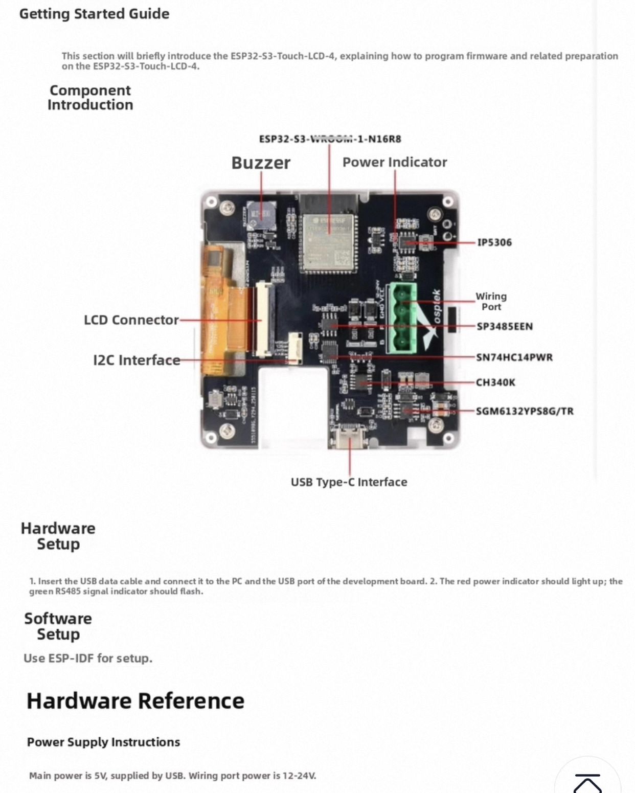
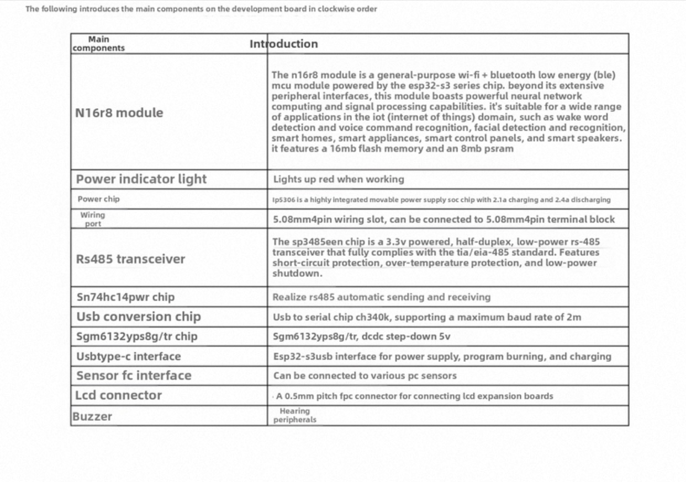
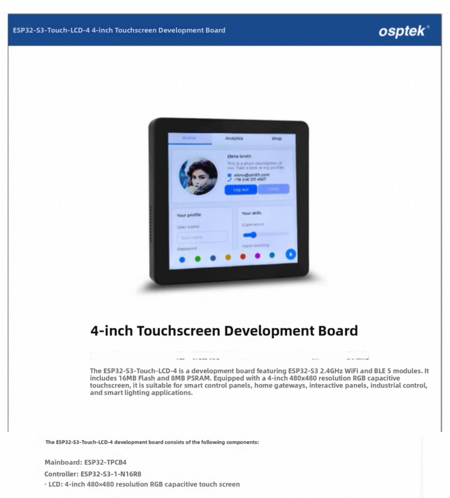

<div align="center">

# 🎛️ OspreyPi ESP32-S3 Smart Display

### ESPHome Modular LVGL Touch Interface

[](https://esphome.io/)
[](https://www.home-assistant.io/)
[](LICENSE)
[](https://lvgl.io/)

**A powerful, modular ESPHome configuration for the ESP32-S3 480x480 smart display with LVGL touch interface, designed for seamless Home Assistant integration.**

[Features](#-features) • [Hardware](#-hardware-specifications) • [Installation](#-installation) • [Configuration](#-configuration) • [Gallery](#-device-gallery) • [Documentation](#-documentation)

</div>

---

## 📖 Overview

This project provides a comprehensive, modular ESPHome configuration using LVGL (Light and Versatile Graphics Library) to create beautiful, interactive touch interfaces on a 480x480 ESP32-S3 smart display. Perfect for controlling Home Assistant entities, monitoring sensors, and creating custom dashboards.

### 🎯 Key Highlights

- **Modular Architecture**: Reusable button templates, widgets, and pages
- **Rich UI Components**: Light controls, switches, dimmers, color pickers, and custom widgets
- **Smart Features**: Screensaver with weather, automatic backlight control, swipe navigation
- **Home Assistant Native**: Deep integration with HA entities and services
- **High Performance**: Optimized LVGL rendering with 20% buffer size
- **Customizable**: Extensive theme system with color palettes and fonts

---

## ✨ Features

### 🎨 User Interface
- **Interactive Touchscreen**: 480x480 IPS display with capacitive touch
- **LVGL Graphics**: Modern, fluid UI with smooth animations
- **Swipe Navigation**: Gesture-based page switching
- **Dynamic Screensaver**: Weather information, time, and custom backgrounds
- **Adaptive Backlight**: Day/night brightness control based on time

### 🏠 Home Assistant Integration
- **Entity Control**: Lights, switches, scripts, and scenes
- **Real-time Updates**: Live state synchronization with HA
- **Color Picker**: RGB/RGBW light color control
- **Dimming Controls**: Brightness sliders for supported lights
- **Media Controls**: Play/pause and other media functions

### 🔧 Hardware Features
- **ESP32-S3**: Powerful dual-core processor with 16MB Flash, 8MB PSRAM
- **RGB Display Interface**: ST7701S driver with 18-bit color
- **I2C Touch**: FT6336 capacitive touch controller
- **Onboard Buzzer**: Tactile feedback (GPIO 42)
- **OTA Updates**: Wireless firmware updates with status display

### 📦 Modular Components
- **Button Templates**: Light, switch, dimmer, scene, script buttons
- **Sensors**: System diagnostics, WiFi status, memory usage
- **Pages**: Main page, info page, loading screen, screensaver
- **Widgets**: Reusable UI components and navigation elements
- **Weather**: Integrated weather display with icons

---

## 🔧 Hardware Specifications

### 📱 Device Overview

**OspreyPi ESP32-S3-4848S040 Smart Screen**

| Specification | Details |
|---------------|---------|
| **MCU** | ESP32-S3-1-N16R8 |
| **Flash** | 16MB |
| **PSRAM** | 8MB Octal (80MHz) |
| **Display** | 3.95" / 4.0" IPS TFT |
| **Resolution** | 480×480 pixels |
| **Display Driver** | ST7701S (3-wire SPI + RGB) |
| **Touch Controller** | FT6336 (I2C) |
| **Interface** | 18-bit RGB565 |

### 📍 Pinout Configuration

#### Display Interface (ST7701S)
| Signal | GPIO | Description |
|--------|------|-------------|
| **CS** | 45 | SPI Chip Select |
| **SCLK** | 38 | SPI Clock |
| **MOSI** | 39 | SPI Data Out |
| **DE** | 47 | Data Enable |
| **VSYNC** | 21 | Vertical Sync |
| **HSYNC** | 14 | Horizontal Sync |
| **PCLK** | 48 | Pixel Clock (16MHz) |
| **Backlight** | 13 | PWM Backlight Control |

#### RGB Data Bus (18-bit)
| Color | GPIO Pins | Bits |
|-------|-----------|------|
| **Red** | 17, 16, 15, 7, 6 | R0-R4 (5-bit) |
| **Green** | 46, 3, 20, 19, 8, 18 | G0-G5 (6-bit) |
| **Blue** | 0, 12, 11, 10, 9 | B0-B4 (5-bit) |

#### Touch Interface (FT6336)
| Signal | GPIO | Description |
|--------|------|-------------|
| **SDA** | 5 | I2C Data |
| **SCL** | 4 | I2C Clock |
| **RST** | N/C | Not Connected |
| **IRQ** | N/C | Not Connected |

#### Additional Peripherals
| Component | GPIO | Notes |
|-----------|------|-------|
| **Buzzer** | 42 | PWM-driven speaker |
| **UART0 TX** | 43 | Debug/RS485 |
| **UART0 RX** | 44 | Debug/RS485 |
| **RS485 EN** | 40 | Modbus DE/RE (experimental) |

> 💡 **Note**: RS485/Modbus pins are experimental. To enable RS485, uncomment `baud_rate: 0` in logger configuration.

### 🔗 Datasheets & Resources

- **Display**: [OspreyPi 480×480 Smart Screen](https://yuyinglcd.com/products/1/4/245)
- **Touch IC**: [FT6336U Datasheet](hardware/D_FT_6336_U_Data_Sheet_V1_1_410131a74f.pdf)
- **MCU**: [ESP32-S3 Datasheet](hardware/ESP32-S..25.pdf)
- **Hardware Config**: [`osptek-esp32-s3-48x48.yaml`](esphome-modular-lvgl-buttons/hardware/osptek-esp32-s3-48x48.yaml)

---

## 📸 Device Gallery

<p align="center">
  
  
  
</p>
<p align="center"><i>Schematics & Circuit Design</i></p>

<p align="center">
  
  
  
</p>
<p align="center"><i>Assembled Device Photos</i></p>

---

## 🚀 Installation

### Prerequisites

- **ESPHome** installed (version 2024.11.0+ recommended)
- **Home Assistant** (optional, for full integration)
- **Python 3.9+** with pip
- **Git** for cloning repositories

### Quick Start

1. **Clone the Repository**
   ```bash
   git clone https://github.com/yourusername/OspreyPi-esp32-s3-480x480.git
   cd OspreyPi-esp32-s3-480x480
   ```

2. **Initialize Submodule**
   ```bash
   git submodule update --init --recursive
   ```

3. **Configure Secrets**
   ```bash
   cp secrets(example).yaml secrets.yaml
   ```
   
   Edit `secrets.yaml` with your WiFi credentials and Home Assistant details:
   ```yaml
   wifi_ssid: "your_wifi_ssid"
   wifi_password: "your_wifi_password"
   api_password: "your_api_password"
   ota_password: "your_ota_password"
   ```

4. **Compile & Upload**
   ```bash
   esphome run Display01.yaml
   ```

   On first flash, connect via USB. Subsequent updates use OTA.

---

## ⚙️ Configuration

### Main Configuration File

The primary configuration is in [`Display01.yaml`](Display01.yaml), which uses a modular package system:

```yaml
packages:
  wifi: !include esphome-modular-lvgl-buttons/common/wifi.yaml
  ha_control: !include esphome-modular-lvgl-buttons/common/ha_control.yaml
  ota_screen: !include esphome-modular-lvgl-buttons/common/ota.yaml
  colors: !include esphome-modular-lvgl-buttons/common/color.yaml
  fonts: !include esphome-modular-lvgl-buttons/common/fonts.yaml
  # ... more packages
```

### Customization Options

#### Theme & Colors
Edit the `substitutions` section in `Display01.yaml`:

```yaml
substitutions:
  text_color: white
  bg_color: black
  button_on_color: "ep_orange"
  button_off_color: "sky_blue"
  icon_on_color: "yellow"
  icon_off_color: "white"
```

#### Backlight Control
```yaml
substitutions:
  touchscreen_daytime_brightness: "100%"
  touchscreen_nighttime_brightness: "50%"
  screen_night_hour: '0'
  screen_night_minute: '0'
```

#### Button Configuration
Add buttons by including templates in the LVGL `widgets` section:

```yaml
- button: !include
    file: esphome-modular-lvgl-buttons/buttons/light_button.yaml
    vars:
      uid: button_1
      height: $button_height_double
      text: bedroom
      icon: $mdi_lightbulb
      entity_id: "light.bedroom_lights"
```

### Button Types Available

| Type | File | Use Case |
|------|------|----------|
| `light_button.yaml` | Standard light switch | On/off lights |
| `dimmer_light_button.yaml` | Dimmable light | Brightness control |
| `switch_button.yaml` | Generic switch | HA switches |
| `script_button.yaml` | Script trigger | HA scripts/automations |
| `scene_button.yaml` | Scene activation | HA scenes |
| `fullscreen_icon_button.yaml` | Large icon button | Media controls |

---

## 📁 Project Structure

```
OspreyPi-esp32-s3-480x480/
├── Display01.yaml              # Main configuration file
├── secrets.yaml                # WiFi & API credentials (not in git)
├── DEVICE_SPECS.md            # Detailed hardware documentation
├── README.md                  # This file
├── hardware/                  # Datasheets and schematics
│   └── img/                   # Device photos
└── esphome-modular-lvgl-buttons/  # Submodule with reusable components
    ├── assets/                # Images, icons, backgrounds
    ├── buttons/               # Button templates
    ├── common/                # Shared configs (WiFi, colors, fonts)
    ├── pages/                 # UI pages (main, info, screensaver)
    ├── sensors/               # Sensor templates
    ├── widgets/               # Reusable UI widgets
    └── hardware/              # Hardware-specific configs
```

---

## 🎨 UI Layout

### Main Page (480×480 - 3 Column Grid)

```
┌──────────────┬──────────────┬──────────────┐
│   Button 1   │   Button 4   │   Button 7   │
│   Bedroom    │   WLED Bed   │     WLED     │
│   (double)   │   (double)   │   (double)   │
├──────────────┼──────────────┼──────────────┤
│   Button 2   │   Button 5   │   Button 8   │
│     Fun      │  Play/Pause  │    (Empty)   │
│   (single)   │   (single)   │   (single)   │
├──────────────┼──────────────┼──────────────┤
│   Button 3   │   Button 6   │   Button 9   │
│    Pantry    │    Sleep     │     Exit     │
│   (single)   │   (single)   │   (single)   │
└──────────────┴──────────────┴──────────────┘
```

**Button Heights:**
- **Single**: 109px
- **Double**: 228px
- **Width**: 150px (all buttons)

---

## 🔍 Advanced Features

### Weather Integration
The screensaver displays current weather from Home Assistant:
- Temperature
- Weather condition icons
- Humidity and other sensor data
- Customizable update intervals

### OTA Updates with Visual Feedback
View real-time upload progress directly on the display during firmware updates.

### Diagnostic Information
Access system info via the info page:
- WiFi signal strength
- Uptime
- Memory usage
- IP address
- ESPHome version

### Swipe Navigation
Navigate between pages with horizontal swipe gestures for a modern mobile-like experience.

---

## 🛠️ Troubleshooting

### Common Issues

**Display not working:**
- Verify power supply provides adequate current (≥2A recommended)
- Check RGB pin connections match configuration
- Ensure correct display driver initialization sequence

**Touch not responding:**
- Confirm I2C pins (SDA: 5, SCL: 4)
- Check FT6336 address (usually 0x38)
- Verify touch controller is detected in logs

**WiFi connection fails:**
- Double-check `secrets.yaml` credentials
- Ensure 2.4GHz WiFi network (ESP32 doesn't support 5GHz)
- Check signal strength at device location

**Memory errors:**
- Reduce LVGL `buffer_size` if needed (default 20%)
- Optimize included fonts and glyphs
- Disable web server in production (`logger: baud_rate: 0`)

### Debug Mode

Enable verbose logging:
```yaml
logger:
  level: DEBUG  # Change from 'warn' to 'DEBUG'
```

View logs:
```bash
esphome logs Display01.yaml
```

---

## 📚 Documentation

### Official Resources
- [ESPHome Documentation](https://esphome.io/)
- [LVGL Documentation](https://docs.lvgl.io/)
- [Home Assistant](https://www.home-assistant.io/)
- [ESP32-S3 Technical Reference](https://www.espressif.com/en/products/socs/esp32-s3)

### Project Resources
- **Original Project**: [agillis/esphome-modular-lvgl-buttons](https://github.com/agillis/esphome-modular-lvgl-buttons)
- **Device Specifications**: [DEVICE_SPECS.md](DEVICE_SPECS.md)
- **Example Configurations**: [`example_code/`](esphome-modular-lvgl-buttons/example_code/)

---

## 🤝 Contributing

Contributions are welcome! Whether it's bug reports, feature requests, or pull requests:

1. Fork the repository
2. Create a feature branch (`git checkout -b feature/amazing-feature`)
3. Commit your changes (`git commit -m 'Add amazing feature'`)
4. Push to the branch (`git push origin feature/amazing-feature`)
5. Open a Pull Request

---

## 📝 License

This project is licensed under the MIT License - see the LICENSE file for details.

---

## 🙏 Acknowledgments

- **Original Project**: [agillis/esphome-modular-lvgl-buttons](https://github.com/agillis/esphome-modular-lvgl-buttons) - Foundation for modular button system
- **ESPHome Team**: For the amazing ESP32 firmware framework
- **LVGL Project**: For the lightweight graphics library
- **Home Assistant Community**: For inspiration and support

---

<div align="center">

**⭐ If you find this project useful, please consider giving it a star! ⭐**

Made with ❤️ for the Home Assistant community

</div>
