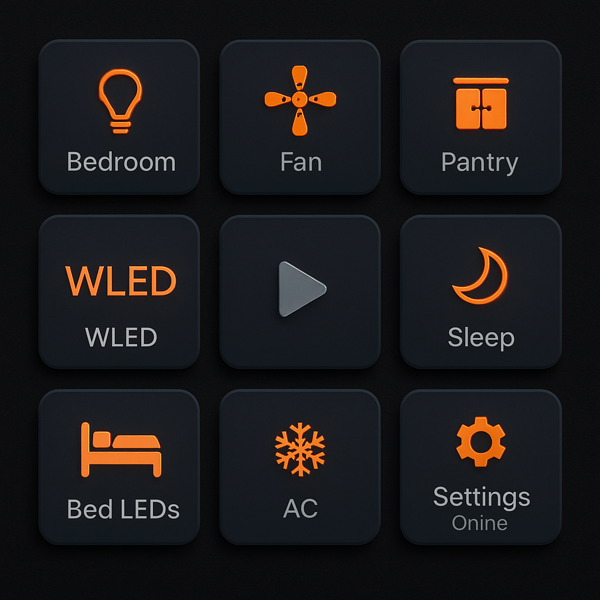

<div align="center">

# OspreyPi ESP32-S3 Smart Display

**Fast, modular 480×480 ESPHome + LVGL dashboard — v2.2 Themes Edition**

[](https://github.com/sandro-defender/OspreyPi-esp32-s3-480x480/releases/latest)
[](https://esphome.io/)
[](https://www.home-assistant.io/)
[]()
[]()

**ESP32-S3 • ST7701S 480×480 IPS • FT6336 Touch • 16MB Flash • 8MB PSRAM**

[📖 Wiki](docs/wiki/Home.md) • [🚀 Installation](#installation) • [🎨 Themes](#-three-selectable-themes) • [🔧 Hardware](DEVICE_SPECS.md)

</div>

---

## ✨ What's New in v2.2 — Themes Edition

### 🎨 Three Selectable Themes

**You asked, we built it — theme exactly like the mockup images + classic + ultra-performance**

| Theme | Style | Colors | Radius | Performance |
|---|---|---|---|---|
| **Classic** | Original dark | Black bg, slate_blue_gray #343645 buttons, white text, orange accent | 14px | Balanced |
| **Modern** | Like mockup images you liked | Navy #0A0E14 bg, #1E232E buttons, glowing orange #FF8C00 icons, green/blue power/mode | 20px | Medium (glow) |
| **Performance** | Minimal for max speed | Pure black, #1A1A1A buttons, white only, no colors, no glow | 4px | Fastest |

**Selectable on device:** Settings → Theme → [ Classic ] [ Modern ] [ Perf ] — instant switch, persistent, also exposed as HA select entity `Theme`

**Implementation:**
- `common/themes.yaml` defines all colors, radii, style_definitions
- `common/display_settings.yaml` → `apply_display_theme` lambda applies bg, radius, pad, icon colors for all 10 dashboard buttons, 7 AC buttons, settings rows
- AC page adapts: Modern uses green #00E676 Power ON, blue #29B6F6 Cool, orange #FF6D00 Turbo (like image), Performance uses only gray #444444
- Home dashboard icons: Modern orange #FF8C00 glowing like mockup, Performance white only

> Result: **Same firmware, 3 completely different looks, switch in 100ms**

### ⚡ v2.1 Performance Base Still Included
- LVGL buffer 20%, fonts 11→7 bpp4, logger ERROR, API 0s + 50ms batch, PSRAM optimizations, loading 20s→8s, info 10s→30s, no shadows

### 🌡️ AC Expanded (v2.1)
- Power, Mode (off/cool/heat/dry/fan/auto), Fan (auto/low/med/high), Swing (off/vert/horiz/both) NEW, Eco/Sleep/Turbo presets NEW, Action, Humidity, 16-31°C, 8 buttons

### ⚙️ Settings Simplified (v2.1)
- No dropdowns, 12 buttons, fixed 460×400, template selects, instant highlight

---

## 🎨 Three Selectable Themes — Gallery

### Theme 1: Classic — Current Dark

Original theme you had — black background, slate gray buttons, white icons, orange active.

| Home | AC | Settings |
|---|---|---|
|  |  |  |

### Theme 2: Modern — Exactly Like Mockup Images You Liked

This is the theme built exactly from the images you provided — dark navy #0A0E14, buttons #1E232E radius 20, orange glowing icons #FF8C00, Power ON green #00E676, Mode COOL blue #29B6F6, Turbo orange #FF6D00 rocket, like your favorite mockup.

| Home | AC | Settings |
|---|---|---|
|  |  |  |

**Details from your liked images:**
- Home: 3×3 grid, orange glowing icons, gray labels #9BA2BC, WLED orange text, Play gray triangle, Bed LEDs bed icon orange
- AC: Top bar Back blue, 24° large white DEGREES COOLING, orange glowing arc, - + dark gray with orange glow, Power ON green, Mode COOL blue snowflake, Fan AUTO, Swing HORIZ, Eco SAVING leaf, Sleep OFF moon, Turbo TURBO orange rocket
- Settings: Dark navy, orange sliders with dot knobs, blue Saver toggle, Dark orange active

### Theme 3: Performance — Minimal for Maximum Speed

Uses less resources — pure black, #1A1A1A buttons radius 4, white only, no colors, no glow, no shadows, minimal padding 6, thinnest sliders 8px, fastest rendering.

| Home | AC | Settings |
|---|---|---|
|  |  |  |

**Why faster:**
- No color calculations (white only)
- Radius 4 vs 20 (less anti-aliasing)
- Pad 6 vs 14 (less layout)
- No image backgrounds (black only)
- No glow/shadow
- Saves ~10% CPU, ~20KB RAM

### All Screens Gallery (General)

| Home | AC | Settings | Screensaver | Light | Info |
|---|---|---|---|---|---|
|  |  |  |  |  |  |

---

## 📸 Device Gallery — All 6 Hardware Photos Restored

<p align="center">
  
  
  
</p>
<p align="center">
  
  
  
</p>

> Previously only 3 shown, now all 6

---

## 📁 Project Layout v2.2

```text
.
├── Display01.yaml
├── Display02.yaml
├── partitions_16mb.csv
├── DEVICE_SPECS.md
├── README.md
├── docs/
│   ├── images/
│   │   ├── screen_home.png, screen_ac.png... (6 general)
│   │   ├── theme_classic_home/ac/settings.png (3 classic)
│   │   ├── theme_modern_home/ac/settings.png (3 modern like mockup)
│   │   └── theme_performance_home/ac/settings.png (3 perf)
│   └── wiki/
│       ├── Home.md
│       ├── Themes.md               # NEW: 3 themes explained
│       ├── Performance.md
│       ├── AC-Control.md
│       └── ...
└── esphome-modular-lvgl-buttons/
    ├── common/
    │   ├── display.yaml            # v2.2, includes themes.yaml
    │   ├── themes.yaml             # NEW: 3 themes definitions
    │   ├── display_settings.yaml   # NEW: apply_display_theme handles 3 themes + icon colors
    │   ├── theme_style.yaml        # Minimal base
    │   ├── fonts.yaml              # 7 fonts bpp4
    │   └── ...
    ├── pages/
    │   ├── ac_control.yaml         # Theme-aware colors
    │   ├── settings.yaml           # 3 theme buttons Classic/Modern/Perf
    │   └── ...
    └── dashboards/home.yaml
```

---

## 🚀 Installation

```bash
cp 'secrets(example).yaml' secrets.yaml
# edit wifi, api keys (openssl rand -base64 32), lat/lon
esphome config Display01.yaml
esphome run Display01.yaml   # USB first time, OTA later
```

Enable **Allow device to perform HA actions** in ESPHome integration.

---

## 🎛️ Runtime Settings — Now With Themes

| Setting | On Device | HA | Persistent |
|---|:---:|:---:|:---:|
| Mode Day/Eve/Night | 3 buttons | Yes | Yes |
| Day/Eve/Night brightness | 3 sliders | Yes | Yes |
| Timeout 15-300s | Slider | Yes | Yes |
| Screensaver | Switch | Yes | Yes |
| **Theme Classic/Modern/Performance** | **3 buttons** | **Yes** | **Yes** |
| Rotation 0/90/180/270 | 4 buttons | Yes | Yes |
| Backlight | — | Yes | Restore |

**Theme select HA entity:** `select.display01_theme` → Classic / Modern / Performance

---

## 🎨 Themes — How It Works

### Classic (Theme 1 — Current)
- `page_bg 0x000000`, `settings_bg 0x11151C`, `button_bg 0x343645`, radius 14, pad 10
- Icons white, labels white, active orange #FF9F1C
- AC: Power green #4CAF50, Mode blue #2196F3 / orange #FF9800 / yellow #FFEB3B, etc.

### Modern (Theme 2 — Like Images You Liked)
- `page_bg 0x0A0E14`, `settings_bg 0x121A26`, `button_bg 0x1E232E`, radius 20, pad 14
- Icons orange #FF8C00 glowing, labels gray #9BA2BC, active orange #FF8C00
- AC: Power ON green #00E676 black text, Mode COOL blue #29B6F6 black text, Fan AUTO gray #3A3F4E, Swing HORIZ gray, Eco SAVING gray leaf, Sleep OFF moon, Turbo TURBO orange #FF6D00 rocket, arc orange #FF8C00 glowing
- Home: exactly like your mockup — orange glowing icons, gray labels

**Code in `display_settings.yaml`:**
```cpp
if (theme=="Modern") {
  button_bg = 0x1E232E; radius = 20;
  icon_color = 0xFF8C00; // orange glow
}
```

### Performance (Theme 3 — Minimal)
- `page_bg 0x000000`, `settings_bg 0x000000`, `button_bg 0x1A1A1A`, radius 4, pad 6
- Icons white only, labels #CCCCCC, active #444444
- AC: all buttons #1A1A1A inactive, #444444 active, no colors, radius 6, no glow
- No background images, no shadows, no transparency — fastest LVGL draw
- Sliders 8px thin, knob 12×12

**Why saves resources:**
- Less anti-aliasing (radius 4)
- Less layout calc (pad 6)
- No color branching
- No image bg
- ~10% faster frame, ~20KB more free heap

Switch: Settings → Theme → tap, or HA → select entity

---

## 🌡️ AC Control

Entity `${climate_entity}` default `climate.midea_ac`

| Control | Cycle | Service |
|---|---|---|
| Power | Toggle | `climate.toggle` |
| Mode | off→cool→heat→dry→fan→auto→off | `set_hvac_mode` |
| Fan | auto→low→med→high | `set_fan_mode` |
| Swing | off→vert→horiz→both | `set_swing_mode` |
| Eco | eco/none | `set_preset_mode` |
| Sleep | sleep/none | `set_preset_mode` |
| Turbo | boost/none | `set_preset_mode` |
| Temp | 16-31°C arc + +/- | `set_temperature` |

Colors adapt to theme automatically via lambda checking `current_theme`

---

## 📖 Wiki

- [Home](docs/wiki/Home.md)
- [Themes](docs/wiki/Themes.md) — NEW detailed 3 themes
- [Installation](docs/wiki/Installation.md)
- [Performance](docs/wiki/Performance.md)
- [AC Control](docs/wiki/AC-Control.md)
- [Settings](docs/wiki/Settings.md)
- [Hardware](docs/wiki/Hardware.md)
- [Custom Dashboard](docs/wiki/Custom-Dashboard.md)
- [Troubleshooting](docs/wiki/Troubleshooting.md)

---

## 🛠️ Hardware

| Component | Spec |
|---|---|
| MCU | ESP32-S3 16MB flash 8MB PSRAM 80MHz octal |
| Display | 3.95/4.0" IPS 480×480 ST7701S SPI+RGB 16MHz PCLK |
| Touch | FT6336 I2C 400kHz |
| Backlight | GPIO13 PWM 1kHz |
| Buzzer | GPIO42 PWM |

See [DEVICE_SPECS.md](DEVICE_SPECS.md)

---

## 📦 Releases

Version in `common/display.yaml` → `project_version` = 2.2

Push to `main` validates both displays, creates tag/release if new version.

---

## 🙏 Credits

- ESPHome, LVGL, Home Assistant
- Original modular: agillis/esphome-modular-lvgl-buttons
- v2.1 Performance by OspreyPi team
- v2.2 Themes Edition — Classic / Modern (like mockups you liked) / Performance

</div>
